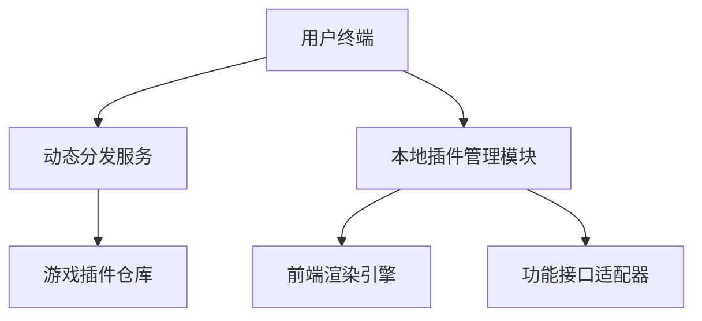

# 桌游辅助App架构设计文档

## 一、系统架构概览

## 二、核心模块划分
### 1. 前端模块
- **动态加载引擎**：基于Flutter实现跨平台（PC/移动端），针对安卓端优化渲染性能（如启用Impeller图形引擎），支持按需加载插件包（安卓端使用.apk格式，存储于应用私有目录/data/data/com.xxx.xxx/plugins）
- **插件管理面板**：展示可下载游戏列表，提供下载/更新/卸载功能
- **通用组件库**：包含规则查询模板、计分器基础组件等复用控件

### 2. 后台模块
- **分发服务**：Node.js+Express实现，提供游戏插件元数据接口（名称/版本/大小/下载地址）
- **插件仓库**：MinIO对象存储，按游戏ID分类存储插件包，支持版本回滚
- **统计服务**：MongoDB记录插件下载量/用户偏好，用于推荐热门游戏

## 三、动态加载机制
- **插件格式**：采用.zip封装（包含前端页面+API接口定义），需包含manifest.json描述文件
- **加载流程**：
  1. 用户选择游戏→请求元数据→下载插件包→校验签名→安卓端解压至应用私有存储目录（避免外部存储权限问题），其他平台解压到本地插件目录
  2. 本地管理模块读取manifest.json，注册路由/组件到主App
  3. 前端引擎通过接口适配器调用插件功能（如调用《卡坦岛》的资源计算器）

## 四、技术选型说明
- 跨平台：Flutter（支持PC桌面版）相比React Native有更好的性能一致性<mcreference link="https://flutter.dev/docs" index="1">1</mcreference>
- 后端：Node.js轻量易扩展，适合快速迭代的分发服务场景
- 存储：MinIO兼容S3协议，支持插件包的高并发下载需求<mcreference link="https://min.io/docs" index="2">2</mcreference>